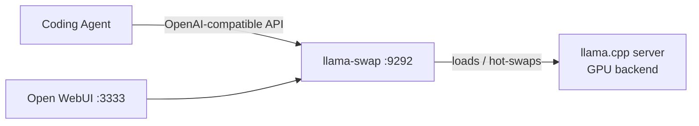

# LLM Dev/Server Setup Automation Scripts

> **New Ubuntu machine (e.g Nvidia DGX Spark, AMD Strix Halo) → working local-LLM inference server. One YAML file. One command.**

A proper inference server is ten install projects wearing a trench coat — GPU toolchain, inference engine, model proxy, web UI, hardened SSH, firewall, monitoring. Done by hand, it's a whole weekend of plumbing before your first token gets generated.

**machine_setup_automation** is a repo of modular, idempotent Bash scripts plus one orchestrator that turns a fresh **Ubuntu** box into a machine that actually *serves* models — and it's replayable on every machine you buy next.

```bash
git clone https://github.com/julweber/machine_setup_automation.git
cd machine_setup_automation
cp machine-config-inference.yml.example machine-config.yml
./run-setup.sh apply
```

That's it. You get llama.cpp compiled for your GPU, llama-swap hot-swapping models at `:9292`, a ChatGPT-style web UI at `:3333`, dashboards at `:3100` — with hardened SSH and UFW firewall rules on the way.



**What you get:**

- **Modular & idempotent** — every `tasks/setup-*.sh` is self-contained; safe to re-run, safe to run alone
- **Your config is the runbook** — enable/disable services and set env vars & args in one YAML file
- **Order guaranteed** — scripts run in the order you listed them; one failure doesn't stop the rest
- **Agent-friendly** — ships an [Agent Skill](https://agentskills.io) so Claude Code, pi, or any compatible agent can set the machine up for you
- **Not just inference** — 30+ services: Forgejo, Nextcloud, n8n, Neovim, monitoring, remote desktop, dev tools, and more

---

## Quick Start with an AI Agent

This repository ships an [Agent Skills](https://agentskills.io)-compatible skill that gives any compatible AI agent (Claude Code, pi, etc.) full context about the available automations, how to configure them, and how to run them.

Point your agent at the skill file:
```
Read and execute the instructions in skills/machine-setup-automation-assistant/SKILL.md
```

The agent will read the README and discover available scripts on its own, then guide you interactively through choosing, configuring, and running the right setup for your machine.

---

## Quick Start
1. **Clone the repository** (or download a zip) and `cd` into it:
   ```bash
   git clone https://github.com/julweber/machine_setup_automation.git
   cd machine_setup_automation
   ```
2. **Make sure you have sudo rights** - all scripts call `sudo` where required.
3. **Copy the example configuration** and edit it to enable the services you want:
   ```bash
   cp machine-config.yml.example machine-config.yml
   ```
   The orchestrator reads `machine-config.yml` by default (or pass `--config <file>` to use a different one).
   Open `machine-config.yml` and set `enabled: true` for the scripts you'd like to install. See the [Configuration](#configuration) section below for the YAML format.
4. **Run the orchestrator**:
   ```bash
   ./run-setup.sh status   # preview what's enabled
   ./run-setup.sh apply    # install all enabled services
   ```
   Run without arguments to see usage instructions.
5. **Follow the on-screen prompts** - most scripts are non-interactive; they print progress and final status messages.
6. After the script finishes you should have:
   - Docker ready (run `docker run hello-world` to double-check).
   - SSH listening on the custom port (`sshd` service is enabled).
   - UFW firewall allowing SSH and other service ports.

---

## How It Works
- **Orchestrator** - `run-setup.sh` reads a YAML configuration file to determine which services to install, then runs them in order. Use `./run-setup.sh status` to preview and `./run-setup.sh apply` to execute. The default config file is `machine-config.yml` in the repository root, or pass a different file with `--config` (before or after the subcommand).
- **Modular task scripts** - Each `tasks/setup-*.sh` script is self-contained and idempotent; it can be run individually or through the orchestrator.
- **Configuration via YAML** - `machine-config.yml` declares which scripts to run, their environment variables, and command-line arguments. All tunable values have sensible defaults and can be overridden.
- **Re-run policy: converge by default** - Re-running a task script against an existing stack converges it: config is re-rendered, existing secrets are reused, and `docker compose up -d` reconciles only what changed — no tear-down, no silent skip. Divergence that cannot be applied to a running stack is printed with the exact re-create command (see `specification/project/conventions.md` → *Re-run policy: converge by default*).

## Configuration

The orchestrator reads `machine-config.yml` to determine which setup scripts to run. A fresh copy is provided as `machine-config.yml.example` — copy it to `machine-config.yml` before running `run-setup.sh apply`:

```bash
cp machine-config.yml.example machine-config.yml
```

A pre-configured inference stack is also available as `machine-config-inference.yml.example`,
which enables the scripts needed for local LLM inference (llama.cpp, llama-swap, Open WebUI, vLLM, etc.).

### YAML Format

```yaml
version: 1

scripts:
  setup-llama-cpp:
    enabled: true
    description: Build and install llama.cpp with CUDA/Metal support
    env:
      LLAMA_CPP_CUDA: 'true'
      LLAMA_CPP_BUILD_TESTS: 'false'
    args:
      - --force
      - --jobs 8
  setup-openwebui:
    enabled: false
    env: {}
    args: []
```

**Top-level structure:**
- `version` — config format version (currently `1`)
- `scripts` — a map of script name → configuration

**Script configuration:**
- `enabled` — set to `true` to run this script, `false` to skip it
- `description` — human-readable description (informational)
- `env` — key-value pairs passed as environment variables to the script
- `args` — command-line arguments passed to the script

All scripts are **disabled by default** — enable only the ones you need.

**SSH / firewall ordering (lockout avoidance):** `setup-sshd` must run
**before** `configure-firewall`. sshd moves to the new port first, and the
firewall then allows that port. With the order reversed, UFW goes to
default-deny around a port sshd is not listening on and the next reconnect
cuts you off the machine. (`machine-config.yml.example` ships in this order —
keep it when copying to `machine-config.yml`.)

### Running the Orchestrator

```bash
./run-setup.sh status   # Show which scripts are enabled/disabled
./run-setup.sh apply    # Install or update all enabled services
./run-setup.sh apply --config path/to/other-config.yml  # Use a custom config file
```

**Options** (may appear before or after the subcommand):
- `--config <file>` / `-c <file>` — Path to a YAML configuration file (default: `machine-config.yml` in the repository root)
- `--non-interactive` — Run all tasks with `INTERACTIVE=false` and `stdin=/dev/null` so a stray prompt fails fast instead of hanging an unattended run (this is the default behaviour)
- `--interactive` — Run all tasks with `INTERACTIVE=true` on an inherited tty (the only opt-in to prompts; mutually exclusive with `--non-interactive`)

`status` is read-only: it never installs anything and exits with a hint if `yq`/`jq` are missing. `apply` auto-installs missing `yq`/`jq` by running `tasks/setup-basics.sh`, except under `--non-interactive`, where they must already be installed (unattended runs fail fast and do not provision the machine; set `ASSUME_SETUP_BASICS=true` to allow the auto-install). A per-script `env:` entry `INTERACTIVE: "true"` in the config overrides the global default for that script (config wins).

When run without any arguments, `run-setup.sh` prints usage instructions.

---

## Service Setup Scripts (`tasks/`)

All service setup scripts are located in the `tasks/` directory. 
For a complete list of automations see [AUTOMATIONS.md](AUTOMATIONS.md)

---

## Customization & Environment Variables

There are two ways to customize the setup:

1. **Edit `machine-config.yml`** — Set environment variables and command-line arguments for each script in the configuration file. This is the recommended way for declarative, reproducible setups.
2. **Edit default values directly** in each task script (e.g., change `LM_STUDIO_VERSION="0.4.0-18"` in `setup-lm-studio.sh`). This is handy for a permanent change across all runs.

---

## Troubleshooting & FAQ
1. **`sudo: command not found`** - Ensure you run the scripts on a system where `sudo` is installed (Ubuntu default). You must have a user with sudo privileges.
2. **Docker fails to start** - After `setup-docker.sh`, verify group membership:
   ```bash
   groups $USER | grep docker && echo "User is in docker group"
   # If not, log out/in or run: newgrp docker
   ```
3. **Port conflicts** - If a port (e.g., `2224`) is already used, export a different value before running the scripts.
4. **LM Studio AppImage does not launch** - Ensure the file at `$HOME/lmstudio_bin` has execute permission (`chmod +x`). The start script `$HOME/lmstudio` runs `./lmstudio_bin --no-sandbox`; you can add additional flags there.
5. **UFW refuses to enable** - Check if another firewall manager (e.g., `firewalld`) is active; disable it or stick with UFW for this automation.
6. **k3s installation fails** - The script uses the official get.k3s.io installer which requires a clean system without conflicting container runtimes. Remove any existing Docker/Kubernetes installations before re-running, or run k3s on a separate VM.

---

## Additional Documentation
- **[README_TRAEFIK.md](README_TRAEFIK.md)** - Complete guide for the Traefik v3 reverse proxy setup script (`setup-traefik.sh`)
- **[README_MANAGING_MODELS.md](README_MANAGING_MODELS.md)** - Guide for managing models via huggingface cli
- **[tests/README.md](tests/README.md)** - Test suite documentation and usage guide
---

## Contributing
Feel free to fork this repository and add new task scripts (e.g., for additional AI tools) or improve existing ones. When adding a script:
- Place it under `tasks/` if it is part of the core provisioning flow, otherwise put it in an appropriate sub-folder.
- Document any environment variables at the top of the file.
- Update this README (or add a new section) describing the purpose and usage.

---

## License & Disclaimer
This project is provided **as-is** without warranty. Use at your own risk, especially when opening ports or running services on publicly reachable machines.
