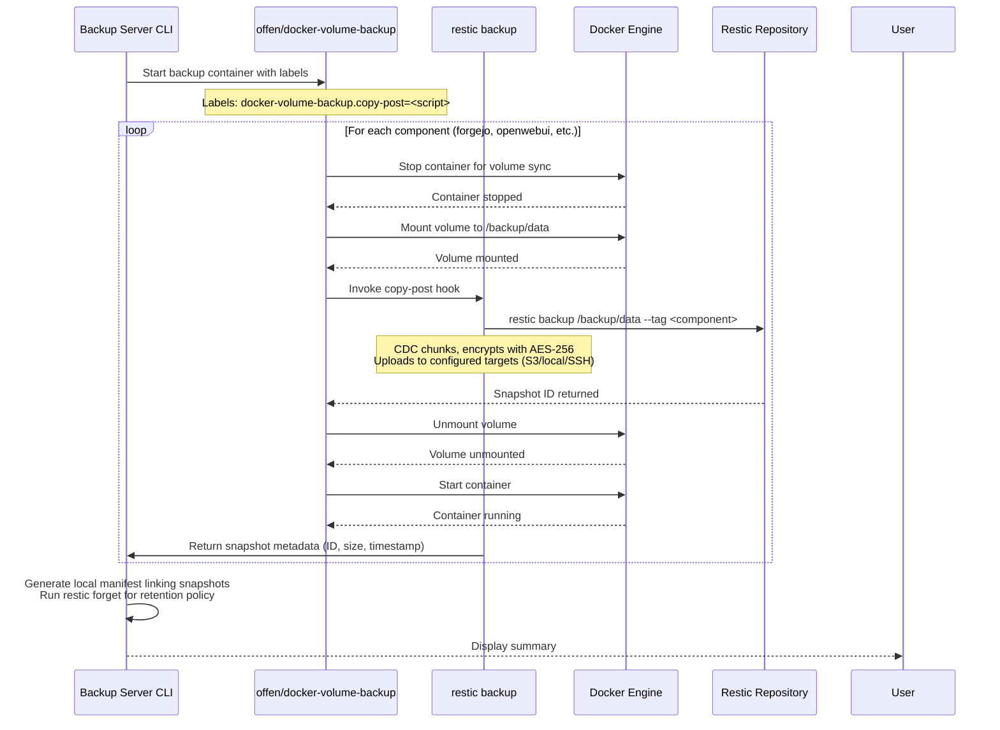
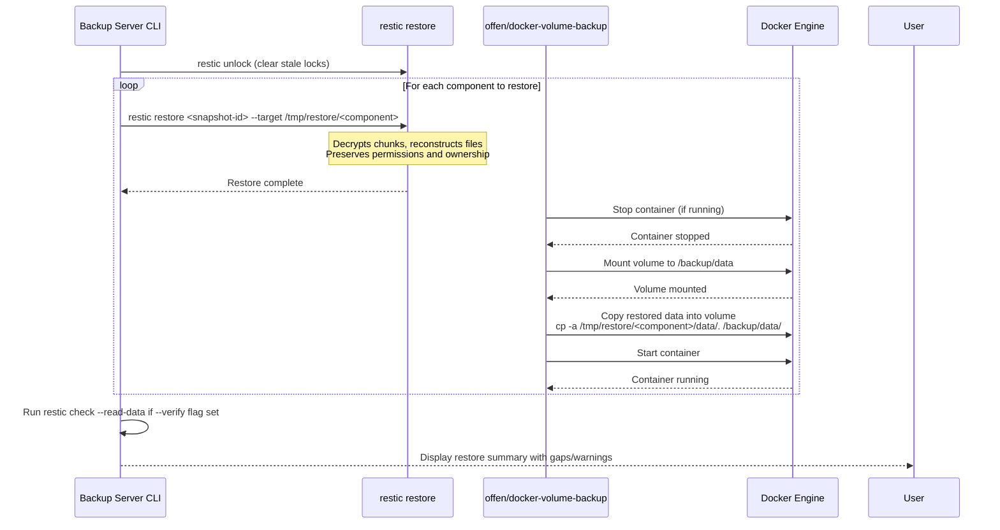

# Implementation Details: Backup Server

## Architecture Overview

The backup server uses a **hybrid two-layer architecture**:

```
┌─────────────────────────────────────────────────────────────────┐
│                    Backup Server CLI Tool                       │
│  (CLI parsing, user interface, orchestration logic)            │
└──────────────┬────────────────────────────────────────────────┘
               │
       ┌───────▼────────┐          ┌─────────────────────────────┐
       │  Offen Layer   │◄────────►│  Restic Layer              │
       │ Orchestration  │          │ Storage Engine             │
       ├────────────────┤          ├─────────────────────────────┤
       │ • Docker       │          │ • AES-256 encryption        │
       │   lifecycle    │          │ • Content-defined           │
       │ • Volume       │          │   chunking (CDC)            │
       │   extraction   │          │ • Deduplication             │
       │ • Pre/Post     │          │ • Multi-backend storage     │
       │   hooks        │          │ • Snapshot management       │
       └───────┬────────┘          └──────────────▲──────────────┘
               │                                 │
         ┌─────▼─────┐                     ┌─────▼─────┐
         │Docker     │                     │Restic     │
         │Volumes    │                     │Repository│
         └───────────┘                     └───────────┘
```

---

## Tool Versions & Requirements

| Component | Minimum Version | Notes |
|-----------|-----------------|-------|
| `offen/docker-volume-backup` | v2.x+ | Uses Docker labels for configuration |
| `restic` | 0.18.x+ | CDC security fix, repository format v2 |
| `Docker Compose` | v2+ | Secrets and label support |
| `bash` | 4.0+ | Associative arrays, improved error handling |

---

## Integration Patterns

### Pattern A: Tar→Restic (Simple)
**Use case**: Quick setup, minimal customization

1. Offen extracts Docker volume to temporary tar archive using `archive-pre` hook
2. Offen's default behavior creates `/tmp/docker-volume-backup/<component>/data.tar.gz`
3. Restic ingests the tar via `copy-post` hook: `restic backup /tmp/.../data.tar.gz`
4. **Pros**: Simple, uses Offen's built-in extraction
5. **Cons**: Slight deduplication penalty (tar is already compressed)

### Pattern B: Direct Volume→Restic (Optimal) ⭐ Recommended
**Use case**: Maximum deduplication efficiency, production use

1. Offen stops containers and extracts volume to mount point `/backup/data`
2. `copy-post` hook calls: `restic backup /backup/data --tag component:<name>`
3. Restic reads raw files directly (no tar compression layer)
4. **Pros**: Maximum deduplication, CDC works on actual file blocks
5. **Cons**: Requires custom restic script in copy-post hook

---

## Data Flow: Full Backup



---

## Data Flow: Incremental Backup

Restic's CDC automatically handles incrementality:

1. **First backup** (`--full`): All file blocks uploaded, stored in repository
2. **Subsequent backups** (no `--full` flag): 
   - Restic reads source files
   - Computes content-defined chunks (typically 100-500KB)
   - Hashes each chunk, compares against existing repository
   - Only uploads NEW/modified chunks
3. **Snapshot chain**: Each snapshot references parent via internal metadata
4. **Efficiency**: Typically <5% of data uploaded for minor changes

> **Note**: The `--incremental` CLI flag is mostly documentation—the tool just calls `restic backup` which always performs CDC-based incremental backups.

---

## Data Flow: Restore



---

## Configuration Mapping

### backup-config.yaml → Offen Environment Variables

| Config Field | Offen Label / ENV | Notes |
|--------------|-------------------|-------|
| `sources.docker_volumes` | Auto-detected via Docker labels | Offen discovers volumes labeled for backup |
| `targets[].location` | `RESTIC_REPOSITORY` | Set by tool before calling restic |
| `encryption.passphrase_file` | `RESTIC_PASSWORD` | Loaded from file, passed to restic |
| `offen.stop_containers_before_backup` | N/A (label-based) | Offen respects container labels |

### backup-config.yaml → Restic Command Flags

| Config Field | Restic Flag | Notes |
|--------------|-------------|-------|
| `targets[].location` | `--repo <location>` | Can be specified multiple times for multi-target |
| `encryption.passphrase_file` | `--password-file` | Or via ENV `RESTIC_PASSWORD` |
| `retention.full_backup_keep` | `--keep-weekly <N>` | Applied via `restic forget` |
| `retention.daily_keep` | `--keep-daily <N>` |  |

---

## Critical Design Decisions (From Research)

### ❌ What NOT to Configure in Offen

1. **No Offen storage backends**: Don't set `AWS_S3_BUCKET_NAME`, `BACKUP_SSH_HOST`, etc.
   - Reason: Otherwise Offen uploads tar AND restic uploads deduplicated data = double upload
   
2. **No Offen encryption**: Disable `GPG_PASSPHRASE` or `AGE_MASTER_KEY`
   - Reason: Double-encrypting destroys CDC deduplication efficiency

3. **No Offen retention**: Don't set `BACKUP_RETENTION_DAYS`
   - Reason: Use `restic forget` for richer policy (weekly/monthly/yearly)

### ✅ What to Configure

1. **Restic repository paths** in `targets[]` array
2. **Snapshot tagging** via restic's `--tag component:<name>` flag
3. **Lock management**: Run `restic unlock` on tool startup
4. **Prune schedule**: Weekly `restic prune` to reclaim space (separate from daily backups)

---

## Error Handling Strategy

### Two-Tool Failure Scenarios

| Scenario | Recovery Path |
|----------|---------------|
| **Offen fails, Restic succeeds** | Data already in repository; run `--restore` to recover volumes |
| **Restic fails after Offen extracts tar** | Tar still exists locally; retry restic backup with same data |
| **Both fail mid-backup** | Check local `/tmp/docker-volume-backup/` for partial archives; re-run full backup |
| **Restic lock conflict** | Tool runs `restic unlock --read-password-from-file`; if stale, force clear |

### Restic-Specific Error Codes

| Exit Code | Meaning | Action |
|-----------|---------|--------|
| 0 | Success | Continue |
| 1 | General error | Check logs for details |
| 2 | Repository locked | Run `restic unlock` or use tool's `--wait` flag |
| 3 | Repository corrupted | Run `restic check --read-data` to diagnose |
| 4 | Password wrong | Verify `passphrase_file` contents |

---

## Performance Optimization Tips

### For Large Repositories (>100GB)

1. **Use SSD cache**: Set `RESTIC_CACHE_DIR=/dev/shm/restic` for in-memory caching
2. **Parallel uploads**: Restic v0.16+ supports parallel upload via `--parallel N` flag (tune to CPU cores)
3. **Bandwidth limiting**: Use `--max-download-speed 50M` if running on shared network
4. **Incremental only**: Avoid frequent full backups; let CDC handle changes

### For Docker Volume Backups

1. **Stop containers before backup**: Reduces file inconsistency risk (Offen handles this)
2. **Use volume labels**: Label volumes with `docker-volume-backup=true` for auto-discovery
3. **Health check timeout**: Set `offen.health_check_timeout=60` for slow-starting services

---

## Implementation Checklist (v1 - No Automated Tests)

### Phase 1: Core Backup/Restore
- [ ] Create custom Docker image extending `offen/docker-volume-backup:v2` with restic installed
- [ ] Implement `copy-post` hook script calling `restic backup` with proper tagging per target
- [ ] Build CLI argument parser using bash getopts (from `lib/helpers.sh`)
- [ ] Implement configuration file parsing using `yq` for YAML
- [ ] Add color-coded output using `lib/helpers.sh` conventions
- [ ] Track ALL snapshot IDs in manifest (one per target)

### Phase 2: Incremental & Management
- [ ] Integrate `restic forget` for per-target retention policies
- [ ] Add `--list-backups` via `restic snapshots --json` (merged across all targets)
- [ ] Implement `--verify` using `restic check --read-data`
- [ ] Add lock management with `restic unlock` on startup

### Phase 3: Polish & Edge Cases (No Automated Tests in v1)
- [ ] Add dry-run mode (`--dry-run`)
- [ ] Implement selective component backup/restore (`--components`)
- [ ] Add progress indicators for long operations
- [ ] Log to `~/.local/state/backup-tool/<timestamp>.log` with ISO 8601 timestamps
- [ ] Validate non-zero exit codes on partial failures

### Phase 4: Testing & Documentation
- [ ] Test with real Docker volumes (Postgres, MongoDB, etc.)
- [ ] Verify checksum integrity after restore
- [ ] Document multi-target backup workflow
- [ ] Create example `backup-config.yaml` for common stacks (Forgejo + OpenWebUI)

---

## Example Custom Restic Script (copy-post hook)

```bash
#!/bin/bash
# This script is called by Offen as the copy-post hook
# $COMMAND_RUNTIME_BACKUP_FILEPATH contains path to extracted volume data

set -euo pipefail

# Load restic configuration from environment
export RESTIC_REPOSITORY="${RESTIC_REPOSITORY:?RESTIC_REPOSITORY required}"
export RESTIC_PASSWORD_FILE="${RESTIC_PASSWORD_FILE:-/run/secrets/restic_password}"

# Extract component name from Offen label
COMPONENT_NAME="${DOCKER_VOLUME_BACKUP_CONTAINER_NAME:-unknown}"

# Tag snapshot with component and timestamp
TIMESTAMP=$(date +%Y-%m-%dT%H:%M:%S)
TAGS="component:${COMPONENT_NAME},backup-date:${TIMESTAMP}"

echo "[RESTIC BACKUP] Starting backup for component: ${COMPONENT_NAME}"

# Run restic backup with deduplication
restic backup "$COMMAND_RUNTIME_BACKUP_FILEPATH" \
  --tag "${TAGS}" \
  --one-file-system \
  --exclude-caches \
  --progress \
  --json | while read -r line; do
    # Parse JSON for progress display
    echo "[$(date +%H:%M:%S)] $line" >> /var/log/backup-tool.log
done

echo "[RESTIC BACKUP] Backup complete: Snapshot ID $(restic snapshots --json | jq -r '.[-1].ID')"
```

---

## Environment Variables Summary

| Variable | Purpose | Required? | Default |
|----------|---------|-----------|---------|
| `RESTIC_REPOSITORY` | Target repository location (local/S3/SSH) | Yes | — |
| `RESTIC_PASSWORD` | Encryption passphrase (or use file) | Yes | — |
| `RESTIC_PASSWORD_FILE` | Path to password file | No | — |
| `RESTIC_CACHE_DIR` | Cache directory for performance | No | `~/.cache/restic` |
| `DOCKER_VOLUME_BACKUP_CONTAINER_NAME` | Component name from Offen label | No | `unknown` |
| `COMMAND_RUNTIME_BACKUP_FILEPATH` | Path to extracted volume data (Offen) | Yes (in hook) | — |

---

## Multi-Target Backup Strategy

To backup to multiple locations simultaneously:

1. **Tool orchestrates**: Loop through configured targets
2. **Restic duplicates**: Each `restic backup` call writes to all targets if `RESTIC_REPOSITORY` is a composite path
   - Example: `export RESTIC_REPOSITORY="s3:s3://bucket1;s3:s3://bucket2"`
3. **Alternative approach**: Run separate restic commands per target, then merge snapshot metadata
4. **Recommendation**: Use Restic's native multi-target support via semicolon-separated paths

---

## Manual Test Scenarios (v1 - No Automated Tests)

### Happy Path Manual Tests
- Full backup of single Docker volume → verify checksums in repository
- Incremental backup after file changes → verify only changed chunks uploaded
- Restore to new hardware → volumes recreated with correct permissions
- Multi-target backup (local + S3) → both locations contain identical data

### Error Path Manual Tests
- Target location unavailable → tool continues with remaining targets, logs warning
- Docker daemon down → clear error message suggesting `systemctl start docker`, exit code 1
- Stale restic lock → `restic unlock` clears, backup proceeds (or fail immediately if configured)
- Checksum mismatch during verify → abort component restore, log detailed error

### Edge Case Manual Tests
- 10GB+ file in volume → progress indicator shows percentage complete
- Interrupted backup (Ctrl+C) → partial snapshot cleaned up, next run resumes
- Retention policy deleting all snapshots → keeps at least one full backup as anchor
- Concurrent tool runs with `--wait` flag → second run waits for lock release

---

## Future Enhancements (Out of Scope v1)

- GUI dashboard for monitoring backups
- Automated restore testing (restore to temporary container, verify data integrity)  
- DB-specific hooks (Postgres/LM Studio dumps before backup)
- Compression level configuration (`--compression zstd` vs `lz4`)
- Bandwidth throttling per target location
- Retry logic with configurable max retries and delays
