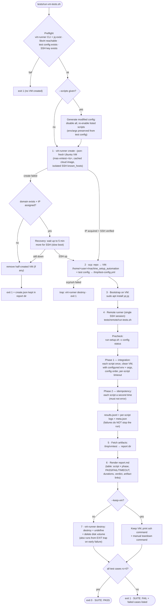

# VM-Based Integration Test Suite

One-command, VM-based integration and idempotency tests for the setup
scripts in [`tasks/`](../tasks/). This implements the integration-test plan
from
[`specification/project/test-strategy.md`](../specification/project/test-strategy.md):
a fresh Ubuntu VM is spun up with
[virt-runner](../../os_projects/virt-runner/README.md), the repository is
copied to it, every enabled script from the test config is run **twice**
(first run = integration, second run = idempotency), the VM is destroyed,
and a Markdown test report is produced.

```console
$ tests/run-vm-tests.sh
...
==============================================
VM TEST SUITE: PASS (17/17 test cases)
Report:  tests/reports/vmtest-20260827-143219/report.md
==============================================
```

## What Is Tested

For **every enabled script** in the test config
([`machine-config.test.yml`](machine-config.test.yml)):

| Phase | Meaning | Pass condition |
|---|---|---|
| **precheck** | `run-setup.sh -c <test-config> status` — the orchestrator must be able to parse the config on the VM | exit 0 |
| **integration** | First run of the script on a **clean** VM (with its configured env vars and args, in config order) | exit 0 |
| **idempotency** | Second run of the same script on the **same** (now provisioned) VM | exit 0 |

So a suite of N scripts produces 2·N + 1 test cases. Scripts run in the
order they appear in the test config (order matters: `setup-basics` first,
`setup-docker` before `setup-traefik`, …). A failing script does **not**
stop the run — every configured script is tested and the report lists all
failures.

### Default script set

The default test config enables a fast, safe, non-interactive subset:

| Script | Why it is in the default set |
|---|---|
| `setup-basics` | Needed first (git, yq, jq, nvm/node, …); fast enough |
| `configure-firewall` | UFW on a fresh VM (with `SSHD_PORT: "22"`, see below) |
| `setup-docker` | Core dependency for docker-based services |
| `setup-sshd` | sshd hardening (with `SSHD_PORT: "22"`) |
| `setup-fail2ban` | systemd service, fast (with `SSHD_PORT: "22"`) |
| `setup-neovim` | tarball install + plugins |
| `setup-pi` | npm-based (needs node from `setup-basics`) |
| `setup-traefik` | docker-based, needs `setup-docker`; skips cleanly on re-run |

Heavy build/GPU/container-farm scripts (`setup-llama-cpp`, `setup-vllm`,
`setup-monitoring`, `setup-nextcloud`, …) are **not** in the default set.
They can be tested ad hoc with `--scripts` (see below) and usually need a
bigger VM (`--ram`, `--disk`) and a larger `--timeout`.

## How to Run

### Prerequisites (host)

- Ubuntu host with **KVM** (`/dev/kvm`) and **libvirt**, where the user can
  run `virsh` **without sudo**.
- An **active `vm-pool`** storage pool and the **active `default` NAT
  network** (dnsmasq, `192.168.122.0/24`) — the same prerequisites as
  virt-runner.
- The **`virt-runner` CLI** (e.g. installed via `uv tool install .` in the
  virt-runner repo, or run through a wrapper), so that the configured command
  resolves on `PATH` — see the virt-runner README. The single `virt-runner`
  entrypoint (`create` / `destroy` / `list`, all with `--json`) replaces the
  former `vm-create` / `vm-destroy` scripts. Override the command with
  `VIRT_RUNNER`.
- A public SSH key to inject into the VM
  (default `~/.ssh/id_ed25519.pub`, override with `VM_SSH_KEY`).
- `scp`, `virsh` in `PATH`.
- `yq` and `jq` in the host `PATH` (needed for `--scripts` config
  generation and for ordering the report; without them the report falls
  back to alphabetical order).

> **yq note:** the pipeline works with both mikefarah `yq` and the Python
> `yq` (jq wrapper) that Ubuntu ships — all queries are plain
> jq-compatible filters, so no special yq flavor is required on the host
> **or** on the VM.

### Quick start

```console
# Full default suite (8 scripts × 2 phases + precheck, ~15-30 min):
tests/run-vm-tests.sh

# Only a subset of scripts (comma-separated list):
tests/run-vm-tests.sh --scripts setup-docker,setup-traefik

# Keep the VM afterwards for debugging:
tests/run-vm-tests.sh --keep-vm

# Bigger VM for heavier scripts, longer per-script timeout:
tests/run-vm-tests.sh --scripts setup-llama-cpp --ram 8 --disk 60 --timeout 120

# Different Ubuntu release / VM user:
tests/run-vm-tests.sh --release noble --user ubuntu

# A custom test config:
tests/run-vm-tests.sh --config /path/to/my-test-config.yml
```

Typical wall-clock time: VM creation 1–3 min (the ~820 MiB cloud image is
cached by virt-runner after the first download), then the test phase
dominates. The full default suite takes roughly 15–30 minutes on the
default 4 GiB / 2 vCPU VM.

### CLI reference

```
tests/run-vm-tests.sh [OPTIONS]

  --name NAME        VM name (default: mas-vmtest-<YYYYmmdd-HHMMSS>)
  --scripts A,B,C    Test only these scripts (comma-separated; overrides
                     the enabled set in the test config, env/args for each
                     script are still taken from the test config)
  --config FILE      Test config file (default: tests/machine-config.test.yml)
  --release REL      Ubuntu release codename (default: resolute)
  --ram GB           VM RAM in GiB (default: 4)
  --vcpu N           VM vCPU count (default: 2)
  --disk GB          VM disk in GiB (default: 30)
  --user USER        VM user name (default: ubuntu)
  --timeout MIN      Per-script timeout on the VM (default: 30)
  --keep-vm          Do not destroy the VM after the run (debugging)
  -h, --help         Show help
```

| Environment variable | Meaning | Default |
|---|---|---|
| `VIRT_RUNNER` | Command to invoke virt-runner (must resolve on `PATH`) | `virt-runner` |
| `VM_SSH_KEY` | Public SSH key injected into the VM | `$HOME/.ssh/id_ed25519.pub` |

### Exit codes

| Code | Meaning |
|---|---|
| 0 | All test cases passed (precheck + both phases for every script) |
| 1 | One or more test cases failed, **or** the pipeline itself failed (VM creation, copy, …) |
| 2 | Usage error (unknown option) |

## Workflow: How the Tests Are Run



Step by step:

1. **Preflight.** Fails fast if the `virt-runner` command or `jq` is missing,
   libvirt is unreachable, the test config or the SSH key cannot be found.
   No VM is created on failure.
   If `--scripts` was given, a modified config is generated in the report
   directory (all scripts disabled, the listed ones enabled again; env/args
   for scripts that already exist in the test config are preserved, unknown
   scripts are added with empty env/args).
2. **VM creation.** `virt-runner create --json` downloads (once, then
   cached) the Ubuntu cloud image, creates the domain in `vm-pool` on the
   `default` NAT network, boots it with cloud-init (SSH key + cloud user
   injected), waits for the DHCP lease and **verifies a real SSH
   round-trip** before reporting success. stdout is a single JSON document
   (also on failure, where `error.code`/`error.message` explain the abort
   and already-created resources are still reported); the harness parses
   the IP from `.vm.ip`. If virt-runner's own 90 s SSH window expires
   (slow first boot), the harness retries SSH for up to 5 more minutes
   before giving up.
3. **Copy.** The whole repository is copied with `scp -r` to
   `/home/<user>/machine_setup_automation` on the VM (including `tasks/`,
   `lib/`, `templates/`, `run-setup.sh`), plus the active test config to
   `/tmp/test-config.yml` (also covers generated/custom configs outside the
   repo).
4. **Bootstrap.** `sudo apt-get install -y yq jq` on the VM (idempotent, a
   few seconds) — the remote runner needs `yq`/`jq` to read the config.
5. **Remote test run.** The in-VM runner
   ([`remote/run-tests.sh`](remote/run-tests.sh)) executes, in **config
   order**:
   1. the **precheck** (`run-setup.sh -c <config> status`),
   2. **phase `integration`** — every enabled script once,
   3. **phase `idempotency`** — every enabled script a second time.

   Each script runs as the VM user (which has passwordless sudo; the task
   scripts use `sudo` internally) under `timeout --kill-after=60 <N>m` with
   exactly the env vars and args the test config defines for it. Each test
   case produces:
   - a log file: `/tmp/vmtest/logs/<phase>-<script>.log`
     (plus `precheck-run-setup-status.log`),
   - one JSON line in `/tmp/vmtest/results.jsonl`:
     `{"script": ..., "phase": ..., "rc": ..., "duration_s": ..., "log": ...}`.

   A failing script never stops the run — the loop continues so the report
   shows the full matrix. `meta.json` records the guest hostname/OS/kernel.
   Result codes: `0` = pass, `124` = per-script timeout, `125` = script
   missing on disk, anything else = the script's own exit code.
6. **Fetch + report.** `/tmp/vmtest` is fetched back and rendered into
   `report.md` (see below).
7. **Teardown.** `virt-runner destroy` destroys the domain, undefines it
   and deletes its `<name>_vda.qcow2` volume from `vm-pool`. This runs both
   at the end of a normal run **and** from an `EXIT` trap, so early failures
   (scp, bootstrap, …) never leak a VM. `--keep-vm` skips destruction and
   prints the SSH command plus the manual teardown command.

## Reports & Artifacts

Every run creates `tests/reports/vmtest-<timestamp>/` (git-ignored):

```
tests/reports/vmtest-<ts>/
├── report.md               ← the test report (start here)
├── create.json             ← virt-runner create output (single JSON document)
├── create-stderr.log       ← stderr of the create call
├── scp.log                 ← repo copy output
├── bootstrap.log           ← apt bootstrap output on the VM
├── runner.log              ← remote runner console output
├── destroy.json            ← virt-runner destroy output (single JSON document)
├── destroy-stderr.log      ← stderr of the destroy call
├── config.generated.yml    ← only when --scripts was used
├── ssh_config / ssh-known-hosts / vmhome-bin/   ← isolated SSH plumbing
└── vmtest/
    ├── results.jsonl       ← machine-readable results (one object per test case)
    ├── meta.json           ← guest hostname, OS, kernel, date
    └── logs/
        ├── precheck-run-setup-status.log
        ├── integration-<script>.log
        └── idempotency-<script>.log
```

`report.md` contains the run metadata (host, repo commit, VM name/IP/size,
guest OS, config, timeout), a **script × phase** result table
(`PASS (Ns)` / `FAIL (rc=N, Ns)` / `TIMEOUT (Mm)`), the precheck result,
the overall **PASS/FAIL verdict** with a list of failed cases, and links to
all artifacts. Failed scripts' logs live in `vmtest/logs/` — the last lines
of each failing script are also echoed to the console output.

For a failed script, check the corresponding log, e.g.:

```console
tests/reports/vmtest-<ts>/vmtest/logs/integration-setup-traefik.log
```

With `--keep-vm` you can additionally log into the VM directly
(`ssh <user>@<ip>`) and reproduce a script manually.

## Test Configuration

[`machine-config.test.yml`](machine-config.test.yml) follows the same
schema as `machine-config.yml` (`enabled`, `description`, `env`, `args` per
script). Only **fast, safe, non-interactive** scripts belong in the default
set. Two rules to keep in mind when editing:

1. **Keep `SSHD_PORT: "22"` on `configure-firewall`, `setup-sshd` and
   `setup-fail2ban`.** The harness reaches the VM on port 22. The scripts'
   default (`2224`) would move sshd / firewall the harness connection and
   lock the run out of the VM mid-suite. (If you ever change the port, the
   harness would have to follow it.)
2. **Order matters.** `setup-basics` first (git/yq/jq/node), `setup-docker`
   before any docker-based service (e.g. `setup-traefik`).

When adding a **new** script to the set: make sure it is non-interactive
without a TTY, safe to run on a clean VM with the default VM user, and — if
it ships containers — that its re-run (phase 2) either skips cleanly or is
genuinely idempotent (the default set only contains scripts that satisfy
this).

`--scripts a,b,c` does **not** edit the test config; it generates a
one-off modified config for that run. Scripts listed there keep the
env/args from the test config; scripts not present in the test config are
added with **empty** env/args — for SSH-port-related scripts that means
their defaults apply, so prefer adding such scripts to the test config
itself.

## Safety & Design Notes

- **Only the run's own VM is ever touched.** The VM is named
  `mas-vmtest-<timestamp>` (matches virt-runner's name regex, never collides
  with pre-existing domains such as `setup-test-vm`). Teardown only
  destroys/undefines that exact domain and deletes its
  `<name>_vda.qcow2` volume.
- **No VM leaks on failure.** `virt-runner destroy` runs from an `EXIT`
  trap whenever the VM was created. A half-created VM (create failed after
  domain creation) is removed explicitly.
- **Isolated SSH host keys.** The libvirt NAT network re-assigns
  `192.168.122.0/24` addresses, so the user's `~/.ssh/known_hosts`
  frequently contains **stale entries** for IPs that now belong to a fresh
  VM — and `StrictHostKeyChecking=accept-new` never overrides a conflicting
  entry. All harness SSH/SCP traffic therefore uses a per-run
  `UserKnownHostsFile` (via a per-run SSH config passed with `-F`), and
  `virt-runner create`'s *internal* SSH verification is wrapped with a one-shot
  `ssh` shim on `PATH` that pins the same isolated file (ssh(1) on this
  platform ignores `SSH_CONFIG` and the `$HOME` env var, so a wrapper is
  the reliable route). The user's `known_hosts` is never modified.
- **Non-interactive by design.** All SSH uses `BatchMode=yes` plus
  `ServerAliveInterval`, so a dead VM cannot hang the pipeline; a dead VM
  fails fast and is torn down.
- **Restarting sshd on the VM is safe.** Ubuntu's `ssh.service` uses
  `KillMode=process`, so `setup-sshd`'s `systemctl restart ssh` does not
  kill the harness' own session (session child processes survive).
- **Continuation on failure.** The remote runner never stops at a failing
  script; you get the complete pass/fail matrix in one run.
- **yq-flavor agnostic.** All config queries are plain jq-compatible
  filters, so the pipeline works with mikefarah `yq` *and* the Python `yq`
  (jq wrapper) that Ubuntu's apt provides — on the host and on the VM.

## Troubleshooting

| Symptom | Cause / fix |
|---|---|
| `virt-runner create failed` + `no DHCP lease after 120s` | libvirt network or disk problem — check `virsh net-info default`, `virsh pool-info vm-pool`, and the report's `create.json` (`error.code`/`error.message`). |
| `virt-runner create timed out waiting for SSH` followed by failure | The guest needs more than 90 s + 5 min (very small VM / slow image). Increase `--ram`/`--vcpu`; inspect the console with `virsh console <name>` **before** the run tears down — use `--keep-vm` if you need the VM afterwards. |
| `could not parse VM IP` | virt-runner JSON contract changed — check `create.json` in the report dir. |
| Script `FAIL (rc=125)` | Script not present in `tasks/` (typo in the config or `--scripts` list). |
| Script `TIMEOUT` | Raise `--timeout` for heavy scripts (e.g. `setup-llama-cpp` builds can take a long time). |
| `scp to VM failed` | VM crashed during copy — the trap destroyed it; re-run. |
| Harness seems to lose the VM mid-run | The guest OOM'd or a script crashed the box. Re-run with `--keep-vm` and a bigger `--ram`, then `ssh` in; check `dmesg`/`/var/log/syslog` on the VM. |
| `yq is required for --scripts` | Install `yq`/`jq` on the host (only needed for `--scripts` and report ordering). |
| A script locks the harness out of the VM | Almost always an SSH-port mismatch — see the `SSHD_PORT: "22"` rule above. Re-run; the trap destroys the orphaned VM automatically. |

## Relationship to the Rest of the Repo

- The test config is a regular `machine-config.yml`-schema file, so
  `run-setup.sh -c tests/machine-config.test.yml status|apply` also works on
  the VM (the precheck exercises `status`).
- Static analysis (ShellCheck) remains the first quality gate and is
  independent of this suite — see
  [`specification/project/test-strategy.md`](../specification/project/test-strategy.md).
- The VM tooling itself (`virt-runner create/destroy/list`, image caching,
  cloud-init) lives in the separate virt-runner project; this suite is a
  consumer of its `--json` CLI contract.
